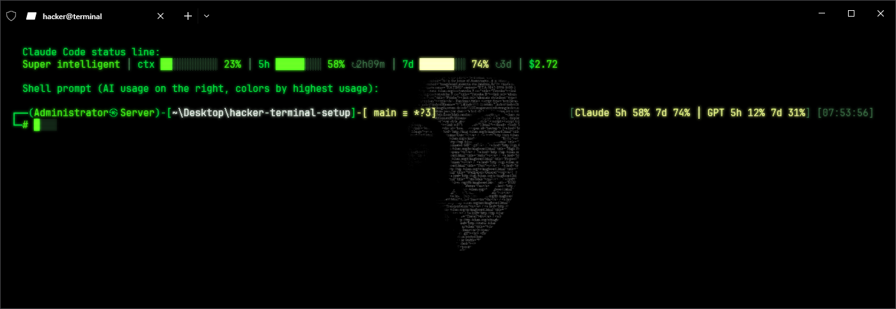
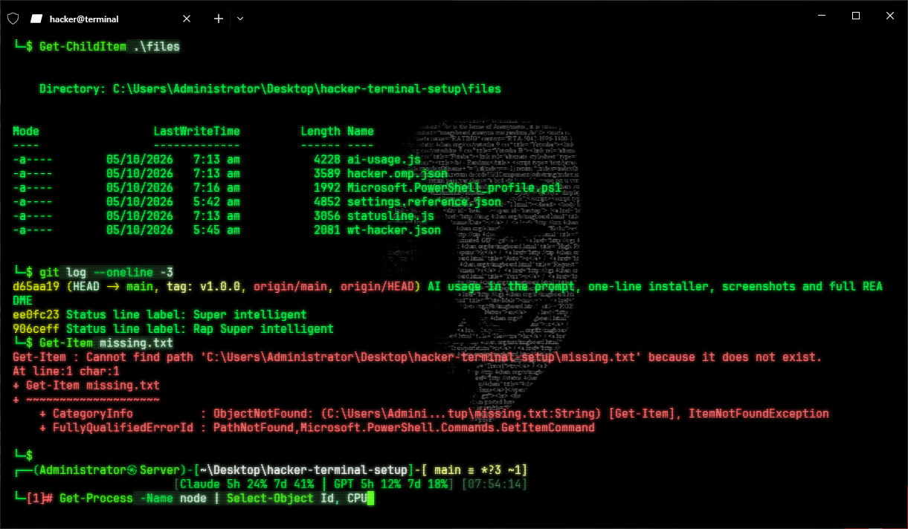
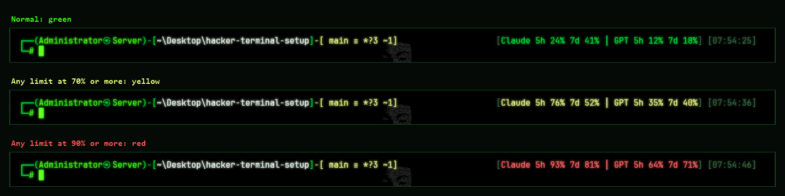
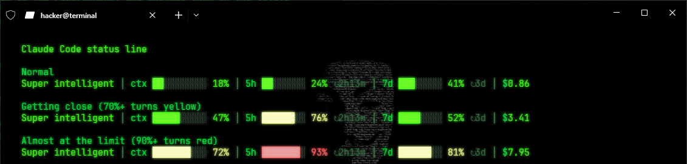

# Hacker Terminal Setup

A green-on-black hacker theme for **Windows Terminal + PowerShell**, with a Kali Linux–style prompt, an Anonymous mask wallpaper, and **AI usage always on screen**: your Claude Code and Codex (ChatGPT) plan limits right in the prompt.



*Example with sample data: Claude Code status line on top, prompt with the AI usage segment on the right.*

## Screenshots

**A normal session:** colored output, the full wallpaper, a red `[1]` after a failed command, and syntax colors while typing:



**AI usage in the prompt** changes color with your highest limit:



**Claude Code status line** at different usage levels:



*Usage numbers in all screenshots are sample data.*

## What you get

| Part | What it does |
|---|---|
| **Hacker color scheme** | Matrix green on pure black, block cursor, green window border, CRT scanline effect |
| **Anonymous wallpaper** | Mask made of code, dimmed behind your text |
| **Kali-style prompt** | `┌──(user㉿host)-[path]-[git branch]` with `$` (or `#` when running as admin), red exit code when a command fails |
| **AI usage in the prompt** | `[Claude 5h 58% 7d 74% │ GPT 5h 12% 7d 31%]`: last known plan usage of each AI agent you use, shown in every terminal. Green normally, **yellow** at 70%, **red** at 90% |
| **Claude Code status line** | Bar at the bottom of Claude Code: context used, 5-hour and weekly limits with reset times, session cost |
| **Green syntax colors** | Commands, parameters, strings etc. colored as you type |
| **VS Code / Cursor terminal** | A green **Hacker Terminal** tab in the editor's built-in terminal: same colors, font, block cursor, prompt and AI usage |

## Requirements

- Windows 10 or 11
- `winget` (built in on Windows 11; on Windows 10 install **App Installer** from the Microsoft Store)

The installer adds everything else: Windows Terminal, oh-my-posh, Node.js and the JetBrainsMono Nerd Font.

## Install

Open **PowerShell** and paste:

```powershell
irm https://raw.githubusercontent.com/Ralph313-creator/hacker-terminal-setup/main/bootstrap.ps1 | iex
```

When it says **Done**, close PowerShell and open **Windows Terminal**.

<details>
<summary>Other ways to install</summary>

**With git:**
```powershell
git clone https://github.com/Ralph313-creator/hacker-terminal-setup $HOME\hacker-terminal-setup
& $HOME\hacker-terminal-setup\install.cmd
```

**Without git:** click **Code → Download ZIP** on this page, extract it, and double-click `install.cmd`.
</details>

### What the installer changes

- Installs Windows Terminal, oh-my-posh, Node.js and the JetBrainsMono Nerd Font (skips what's already installed)
- Copies the prompt to `~\.config\oh-my-posh\`, the usage reader to `~\.config\ai-usage\`, the wallpaper to `~\.config\terminal\`
- Replaces your PowerShell profile (Windows PowerShell, and PowerShell 7 if installed)
- **Adds** the Hacker scheme to Windows Terminal and makes it the default; your existing profiles and schemes stay
- Turns on the Claude Code status line in `~\.claude\settings.json`; your other Claude Code settings stay
- **Adds** a **Hacker Terminal** profile (PowerShell) plus the Hacker colors and font to VS Code, VS Code Insiders and Cursor (whichever you have), and makes it the default terminal; your other editor settings stay. If you picked another shell there (Git Bash, Command Prompt), that stays the default. A Windows Terminal (`wt.exe`) profile is removed, since it opens in a separate window instead of inside the editor. Skip this step with `install.ps1 -SkipVSCode`

Everything it overwrites is backed up next to the original as `*.bak-<timestamp>`. Safe to run again (for example, to update).

## Using it

**Nothing to do: it's on in every new Windows Terminal tab.**

**In VS Code or Cursor:** close any open terminals (trash can icon), then press **Ctrl + `** to open a **Hacker Terminal** tab. If your default is another shell, pick **Hacker Terminal** from the **⌄** next to **+**. The editor can't embed Windows Terminal itself, so the wallpaper and CRT effect only appear in Windows Terminal; the colors, font, prompt and AI usage are the same.

### AI usage in the prompt

The segment on the right of the prompt shows the **last known** usage of each agent:

| Agent | Where the numbers come from | When they update |
|---|---|---|
| **Claude Code** | Claude Code's status line saves them | Whenever Claude Code is open |
| **Codex CLI** (ChatGPT) | Codex's own session logs in `~\.codex\sessions` | After each Codex reply |

- An agent only appears after you've used it at least once.
- A limit disappears once its reset time has passed, since that usage no longer counts.
- Claude limits are shared with claude.ai, so usage on the website is included the next time Claude Code refreshes.
- **Gemini CLI** isn't shown: it doesn't save plan-limit percentages anywhere this theme can read. Its own footer shows context usage.

### Inside the agents

- **Claude Code:** the status line at the bottom is set up automatically.
- **Codex CLI:** Codex has a built-in status line that can show limits. Add this to `~\.codex\config.toml` (merge into an existing `[tui]` section if you have one):
  ```toml
  [tui]
  status_line = ["model-with-reasoning", "current-dir", "context-usage", "used-tokens", "five-hour-limit", "weekly-limit"]
  ```

## Customize

### Windows Terminal (colors, wallpaper, font, cursor)

Press **Ctrl + ,** in Windows Terminal → **Profiles → Defaults → Appearance**, or click **Open JSON file** and edit `profiles.defaults`:

| Want | Change |
|---|---|
| Darker / brighter wallpaper | `"backgroundImageOpacity": 0.4` (lower = darker, `1` = full) |
| Your own wallpaper | put an image in `~\.config\terminal\` and point `"backgroundImage"` at it |
| Plain black, no wallpaper | delete the four `backgroundImage...` lines |
| No CRT scanlines | `"experimental.retroTerminalEffect": false` |
| Different cursor | `"cursorShape"`: `bar`, `underscore`, `vintage`, `filledBox` |
| Font size | `"font": { "size": 11 }` |
| Colors | **Settings → Color schemes → Hacker**, or the `"Hacker"` entry under `"schemes"` |

### VS Code / Cursor terminal

Press **Ctrl + Shift + P** → **Preferences: Open User Settings (JSON)**:

| Want | Change |
|---|---|
| Font size | `"terminal.integrated.fontSize": 14` |
| Colors | the `terminal.*` entries in `"workbench.colorCustomizations"` |
| Tab name | rename the `"Hacker Terminal"` entry under `"terminal.integrated.profiles.windows"`, and `"terminal.integrated.defaultProfile.windows"` to match |
| Different default shell | `"terminal.integrated.defaultProfile.windows"`: `"Hacker Terminal"`, `"Git Bash"` or `"Command Prompt"` |

### Prompt

Edit `~\.config\oh-my-posh\hacker.omp.json`: change any `"foreground"` color, or the `"template"` text of a part. Open a new tab to see changes.

### Typing colors

Run `notepad $PROFILE` and edit the `Set-PSReadLineOption -Colors` block (values are `R;G;B`).

### Claude Code status line

Edit `~\.claude\statusline.js`:
- **Label:** the text in `parts.push(bright('Super intelligent'))`
- **Warning levels:** `70` and `90` in `function level(pct)`

## Uninstall

1. **Windows Terminal:** Settings → Profiles → Defaults → Appearance → pick another color scheme and remove the background image. Or restore the newest `settings.json.bak-*` in `%LOCALAPPDATA%\Packages\Microsoft.WindowsTerminal_8wekyb3d8bbwe\LocalState\`.
2. **PowerShell profile:** restore the newest `Microsoft.PowerShell_profile.ps1.bak-*` in `Documents\WindowsPowerShell\`, or delete the profile.
3. **Claude Code status line:** remove the `"statusLine"` block from `~\.claude\settings.json`.
4. **VS Code / Cursor:** remove the `"Hacker Terminal"` profile and the `defaultProfile` line, the `terminal.*` entries from `"workbench.colorCustomizations"`, and the `terminal.integrated.fontFamily`, `fontSize` and `cursorStyle` lines. Or restore the newest `settings.json.bak-*` in `%APPDATA%\Code\User\` (`%APPDATA%\Cursor\User\` for Cursor).
5. Optionally delete `~\.config\oh-my-posh\hacker.omp.json`, `~\.config\ai-usage\` and `~\.config\terminal\anonymous-code.jpg`.

## Troubleshooting

| Problem | Fix |
|---|---|
| Boxes or `?` instead of icons | The font didn't install. Run `oh-my-posh font install JetBrainsMono`, then restart Windows Terminal |
| `irm ... \| iex` is blocked | Run `Set-ExecutionPolicy -Scope CurrentUser RemoteSigned`, then try again |
| No AI usage in the prompt | Use Claude Code or Codex once; also check `node --version` works |
| Usage numbers look old | They're the last known values; open the agent to refresh them |
| VS Code opens the terminal in a separate window | Its default terminal is Windows Terminal (`wt.exe`). Re-run the installer, or set `"terminal.integrated.defaultProfile.windows": "Hacker Terminal"` |
| Installer says VS Code settings were skipped | The settings file has `/* */` comments or trailing commas the installer can't read safely. Copy the values from `files/vscode-hacker.json` in by hand |
| Theme only in some tabs | The theme is applied to **Defaults**; a profile with its own color scheme overrides it |

## Files

| File | What it is |
|---|---|
| `bootstrap.ps1` | One-line installer: downloads this repo and runs `install.ps1` |
| `install.ps1` / `install.cmd` | Installer (double-click `install.cmd`) |
| `files/wt-hacker.json` | Color scheme, window theme and defaults merged into Windows Terminal |
| `files/vscode-hacker.json` | Hacker Terminal profile, colors and font merged into VS Code / Cursor settings |
| `files/hacker.omp.json` | oh-my-posh prompt |
| `files/Microsoft.PowerShell_profile.ps1` | PowerShell profile (prompt, AI usage refresh, typing colors) |
| `files/ai-usage.js` | Reads Claude Code and Codex usage for the prompt |
| `files/statusline.js` | Claude Code status line |
| `files/settings.reference.json` | Full Windows Terminal settings from the original PC, for reference |

The wallpaper isn't stored here. The installer downloads it from [pixelz.cc](https://pixelz.cc/images/anonymous-mask-code-uhd-4k-wallpaper/).
